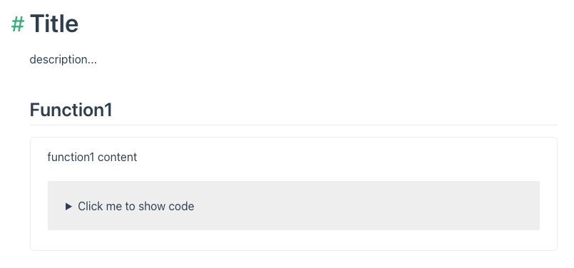

# vuepress-plugin-component-demo

Vuepress component demo block in markdown.

## Install

`npm i -D vuepress-plugin-component-demo`

## Usage

Directory Structure

```
.
├── docs
│   ├── .vuepress
│   │   ├── components
│   │   │   ├── function1.vue
│   │   │   └── function2.vue
│   │   └── config.js
│   └── README.md
```

config.js

```js
import demo from "vuepress-plugin-component-demo";

export default {
  plugins: ["vuepress-plugin-component-demo"],
};
```

README.md

```md
# Title

description...

## Function1

<demo name="function1" />
```

Result



## Options

| Name  | Desc                                         | Example                                               |
| ----- | -------------------------------------------- | ----------------------------------------------------- |
| name  | component name with `./vuepress/components/` | `<demo name="function1" />`                           |
| title | demo block title                             | `<demo name="function1" title="function1 desc..." />` |
| color | demo block border color                      | `<demo name="function1" color="red" />`               |

## Extends

Use custom demo block:

```
.
├── docs
│   ├── .vuepress
│   │   ├── components
│   │   │   ├── custom-demo.vue
```

custom-demo.vue

```vue
<template>
  <div v-html="code"></div>
</template>

<script>
import { CODES } from "@dynamic/demo-codes";

export default {
  props: {
    name: String,
  },
  computed: {
    code() {
      return CODES[this.name];
    },
  },
};
</script>
```

README.md

```md
<custom-demo name="function1" />
```
